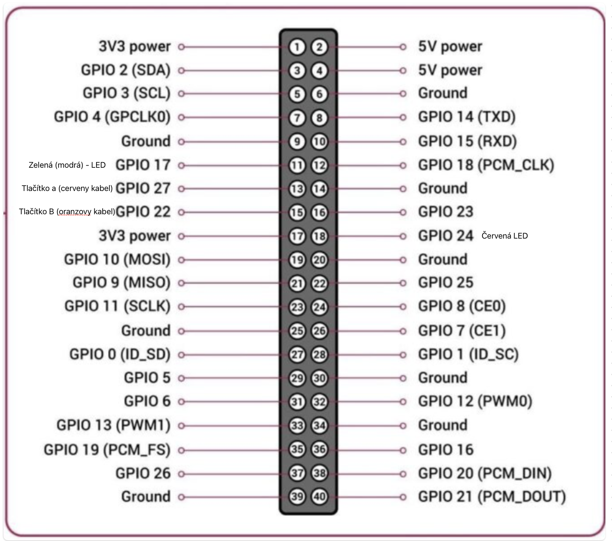

# Ghost Crab

# Checklist

1. Připojit baterku (nabitou)
2. Zapnout RBCX (zapne raspberry pi)
3. Zkontrolovat že je raspberry pi je zapnute (sviti na něm zelena LED)
4. Na Raspberry pi se rozsvítí červená LED
5. Tlačítkem 1 se mění stav červená strana hřiště a modrá (zelená)
6. Tlačítkem 2 se potvrdí a led zhasne
7. a počkat než se znova rozsvítí
8. Na RBCX tlačítkem ON se Začne program

